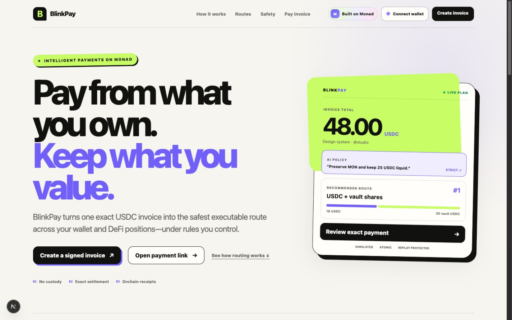
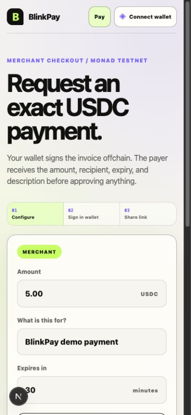
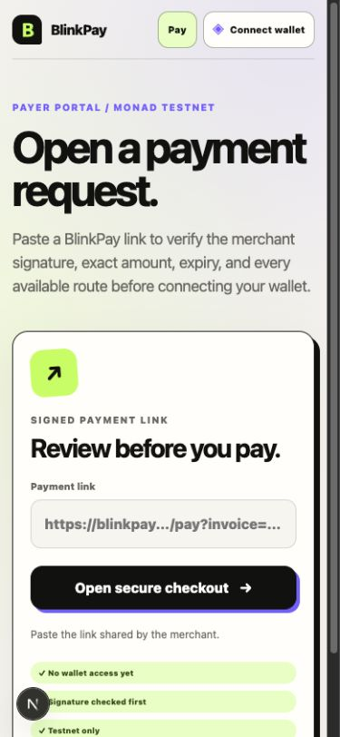

# BlinkPay

**One exact USDC invoice. Five self-custodial ways to pay on Monad.**

[Live application](https://blink-pay-web.vercel.app) ·
[Hardened router](https://testnet.monadscan.com/address/0x6054f7E75E07f5d127DceEA3b2D683959a51c9AA) ·
[Verified payment](https://testnet.monadscan.com/tx/0xb4a23e00583b366aee730f0a6cdbe11544efb1d9a129687979e9b0fa71328571) ·
[Architecture](docs/ARCHITECTURE.md) ·
[Security](docs/SECURITY.md)



BlinkPay is an AI-assisted payment compiler on Monad. A merchant requests an
exact USDC amount; BlinkPay finds a valid way to fund it from the payer's wallet
tokens or supported DeFi positions while enforcing the payer's constraints.

The first release is a self-custodial, onchain checkout—not a Visa or
Mastercard product. The payer always reviews and signs the transaction, and the
AI never signs transactions or invents executable calldata.

| Merchant mobile checkout | Payer mobile portal |
| --- | --- |
|  |  |

## Target demo

1. A merchant creates a signed exact-USDC invoice and shares its link or QR.
2. BlinkPay reads the payer's real Monad balances and supported positions.
3. The payer describes preferences such as "keep my MON and never borrow."
4. Deterministic code quotes, simulates, filters, and ranks real payment plans.
5. The payer signs one plan.
6. The merchant receives the exact USDC amount and an onchain receipt is
   emitted.

## Initial payment routes

1. Direct wallet USDC
2. Exact-output WMON to USDC
3. Exact ERC-4626 vault redemption
4. Atomic wallet USDC + vault redemption
5. Atomic wallet USDC + exact-output WMON

Borrow-to-pay, delegated payments, cross-chain funding, and card rails are not
part of the critical MVP.

## Development method

BlinkPay is being built in test-gated phases. We do not begin the next phase
until the current phase's automated checks and manual acceptance test pass.
See [docs/IMPLEMENTATION_PLAN.md](docs/IMPLEMENTATION_PLAN.md).

## Current status

- [x] Phase 0A: repository and implementation plan
- [x] Phase 0B: application and contract toolchains
- [x] Phase 1A: signed invoice and direct USDC implementation
- [x] Phase 1B: live Monad testnet deployment and two-wallet smoke test
- [x] Phase 2A: exact-output WMON-to-USDC implementation
- [x] Phase 2B: testnet pool and exact-output router integration
- [x] Phase 2C: deploy and fund verified testnet liquidity
- [x] Phase 2D: complete direct and WMON wallet-to-wallet payments
- [x] Phase 3A: deterministic portfolio discovery and route engine
- [x] Phase 3B: live wallet planner acceptance matrix
- [x] Phase 4A: strict natural-language policy compiler and planner constraints
- [x] Phase 4B: isolated Groq/xAI/OpenAI policy adapters with safe fallback
- [x] Phase 4C: live wallet preference-switch acceptance matrix
- [x] Phase 5A: atomic ERC-4626 vault settlement and deterministic constraints
- [x] Phase 5B: live Monad testnet vault/router deployment and funded payer position
- [x] Phase 5C: payer-signed vault payment and independently verified receipt
- [x] Phase 6A: atomic direct-plus-vault and direct-plus-WMON contracts
- [x] Phase 6B: reserve-aware split planner and five-route checkout
- [x] Phase 6C: live direct-plus-vault payment with verified two-source deltas
- [x] Phase 7A: contract, approval, pause, and planner security hardening
- [x] Phase 7B: fuzz, invariant, pinned-fork, browser, dependency, and secret gates
- [x] Phase 7C: exact source verification and hardened live-payment acceptance
- [x] Phase 8A: product UI, mobile checkout, wallet header, and payer entry
- [x] Phase 8B: production hosting, public release documentation, and link audit

The foundation gate passed on July 14, 2026. See
[docs/PHASE_0_REPORT.md](docs/PHASE_0_REPORT.md) for its evidence and known
limitations.

The live testnet gate passed on July 15, 2026: separate merchant and payer
wallets settled one direct USDC invoice and one exact-output WMON invoice, with
onchain balance, event, refund, zero-custody, and replay checks.

The Phase 3 implementation now reads live balances, allowances, quote state,
and replay state; simulates executable routes; and displays deterministic costs,
constraints, rejection evidence, and ranking. See
[docs/PHASE_3_REPORT.md](docs/PHASE_3_REPORT.md) for the scoring model and the
completed manual wallet matrix.

Phase 4 compiles payer language into a versioned, strictly validated policy.
Only documented policy fields reach the planner; executable configuration and
transaction construction remain outside the AI boundary. See
[docs/PHASE_4_REPORT.md](docs/PHASE_4_REPORT.md) for the schema, threat boundary,
fallback behavior, authenticated Groq evidence, and completed wallet gate.

Phase 5 adds one immutable ERC-4626 route. The planner verifies the router's
allowlisted vault, underlying USDC, share balance and allowance,
`previewWithdraw`, `maxWithdraw`, and a payer maximum-share cap. The live
testnet vault is a clearly labelled BlinkPay fixture—not an Euler deployment—
because Euler's official labels currently contain Monad mainnet entries but no
Monad testnet vault list. See [docs/PHASE_5_REPORT.md](docs/PHASE_5_REPORT.md).

Phase 6 adds atomic split settlement. Spendable wallet USDC funds the first
leg, and either an exact ERC-4626 withdrawal or exact-output WMON swap funds
only the remaining shortfall. The live gate settled a 1 USDC invoice from 0.8
wallet USDC plus 0.2 vault USDC in one router call with zero retained balances
and replay protection. See [docs/PHASE_6_REPORT.md](docs/PHASE_6_REPORT.md).

Phase 7 is the hardened release candidate. It adds an owner-controlled payment
pause, exact sell-token funding checks, pause-aware planning and execution,
stateful invariants, a pinned Monad fork regression, browser release tests, and
a documented threat model. The deployed source has an exact Sourcify runtime
match, and a live vault-funded payment passed exact-settlement, zero-custody,
allowance, and replay checks. See [docs/PHASE_7_REPORT.md](docs/PHASE_7_REPORT.md)
and [docs/SECURITY.md](docs/SECURITY.md).

Phase 8 turns the tested system into the public Spark submission: a responsive
landing page, merchant invoice creator, payer portal, live production hosting,
architecture and security documentation, explorer fallbacks, and a timed demo
script. See [docs/PHASE_8_REPORT.md](docs/PHASE_8_REPORT.md).

## Local development

Prerequisites:

- Node.js 22 (Node.js 20.9 or newer is supported)
- pnpm 11.8.0
- Foundry 1.7.1

```bash
cp .env.example .env
pnpm install --frozen-lockfile
pnpm check
pnpm rpc:check
pnpm dev
```

Open `http://localhost:3000`. The foundation screen reads the current Monad
testnet block through the server, so an offline or incorrect RPC is visible
instead of being presented as a successful connection.

For AI-assisted preference parsing, configure one server-only provider key.
Without one, BlinkPay safely falls back to its deterministic parser. Never use
the `NEXT_PUBLIC_` prefix for AI or quote-provider keys.

## Architecture

The merchant signature travels with the invoice link. The payer app turns
natural language into a strict preference schema, then deterministic code reads
current Monad state, rejects unsafe plans, simulates the remaining routes, and
ranks them. Only the payer wallet can authorize approvals and settlement.

The deployed router verifies the invoice, immutable integrations, spend caps,
exact merchant balance delta, zero-new-custody accounting, and replay state.
See [docs/ARCHITECTURE.md](docs/ARCHITECTURE.md) for the diagram and execution
boundary.

## Test and verification

```bash
pnpm check
pnpm test:e2e
pnpm rpc:check
```

The release gate covers TypeScript packages, production build, desktop/mobile
browser behavior, 60 Solidity tests, 512 fuzz cases, 24,576 stateful invariant
calls, and a pinned Monad fork. Live wallet receipts independently verify direct,
WMON, vault, and atomic-split settlement. Detailed evidence lives in the phase
reports under `docs/`.

## Workspace

```text
apps/web/                  Next.js application
packages/chain/            Monad clients, addresses, and configuration tests
packages/core/             EIP-712 invoice types, encoding, ABI, and tests
packages/contracts/        Foundry contracts and Solidity tests
packages/planner/          Typed deterministic discovery, filtering, and ranking
packages/policy/           Strict preference schema, compiler, and AI adapter
docs/                      Architecture and phase evidence
.github/workflows/ci.yml   Reproducible quality gate
```

Phase 1 implementation evidence is recorded in
[docs/PHASE_1_REPORT.md](docs/PHASE_1_REPORT.md). Deployment procedures are in
[docs/DEPLOYMENT.md](docs/DEPLOYMENT.md).

The current deployment, funding, and two-wallet acceptance gate is in
[docs/TESTNET_LIVE_GATE.md](docs/TESTNET_LIVE_GATE.md). The 0x mainnet adapter
remains documented in [docs/PHASE_2_REPORT.md](docs/PHASE_2_REPORT.md).

## Network

- Monad mainnet chain ID: `143`
- Monad testnet chain ID: `10143`
- Native Monad mainnet USDC:
  `0x754704Bc059F8C67012fEd69BC8A327a5aafb603`
- Native Monad testnet USDC:
  `0x534b2f3A21130d7a60830c2Df862319e593943A3`
- Monad testnet WMON:
  `0xFb8bf4c1CC7a94c73D209a149eA2AbEa852BC541`

The verified testnet deployment is:

- BlinkPay pool: `0x88a2208424bFB2D3fc4F299e92993FFe5fAFedb3`
- BlinkPay hardened five-route router: `0x6054f7E75E07f5d127DceEA3b2D683959a51c9AA`
- BlinkPay testnet ERC-4626 vault: `0xbb171586DE327A2c9BB2ea3A7D200B9A92fbeb89`

These addresses are kept in version-controlled chain configuration and checked
against their immutable onchain settings before the quote service uses them.

## Safety principles

- Self-custodial: the user signs every MVP payment.
- Exact settlement: a route reverts unless the invoice is satisfied.
- Allowlisted integrations only.
- User-defined maximum spend, slippage, and deadlines.
- AI produces structured preferences, never transaction targets or calldata.
- Real RPC data and real simulations; no hardcoded success states.
- Testnet-only liquidity is clearly labelled and never represented as 0x.

## License

[MIT](LICENSE) © 2026 Rudra Bhaskar.
