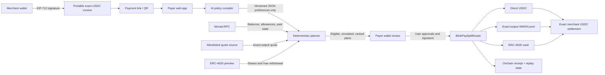

# BlinkPay architecture

BlinkPay separates human intent, deterministic route selection, wallet
authorization, and onchain settlement. The model can narrow preferences but it
cannot create an executable transaction.

## Execution boundary

| Layer | May do | May not do |
| --- | --- | --- |
| AI policy compiler | Translate payer language into a strict, versioned preference schema | Choose addresses, selectors, calldata, quotes, recipients, or signatures |
| Deterministic planner | Read current onchain evidence, enforce hard constraints, simulate, score, and rank | Make an ineligible route executable |
| Payer wallet | Approve exact/capped amounts and sign the selected transaction | Be bypassed by the application |
| Router | Verify the signed invoice, caps, immutable integrations, exact settlement, and replay state | Retain successful payment funds or change integrations |

## Five implemented routes

1. wallet USDC direct to the merchant;
2. WMON exact-output swap to the requested USDC amount;
3. exact ERC-4626 withdrawal from vault shares;
4. wallet USDC plus vault withdrawal in one atomic settlement;
5. wallet USDC plus exact-output WMON in one atomic settlement.

Every route shares the same merchant signature verification, paid-invoice map,
emergency pause, exact merchant balance-delta check, and zero-new-custody
accounting. See [SECURITY.md](SECURITY.md) for the full threat model.
